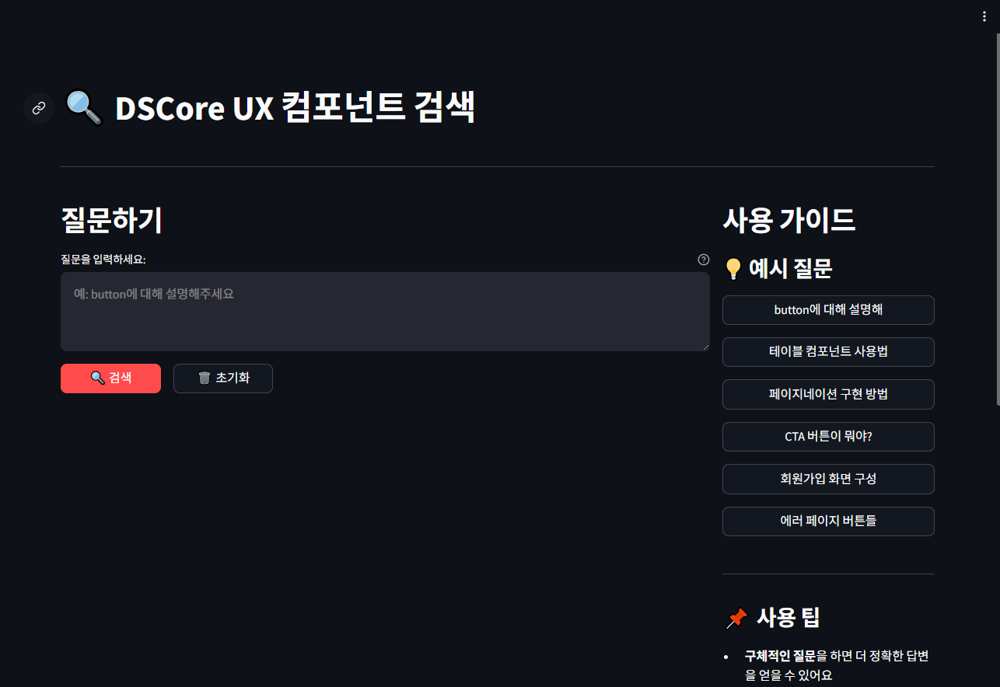

# DSCore UX 컴포넌트 검색 서비스

## 서비스 개요

**DSCore UX 컴포넌트 검색**은 개발자들이 DSCore UX Frame의 컴포넌트를 쉽고 빠르게 찾고 활용할 수 있도록 돕는 AI 기반 검색 서비스


### 주요 목적
- DSCore UX 컴포넌트 문서의 빠른 검색 및 접근 (참고 DSCore UX Frame Storybook : https://dscore-ui.ktds.co.kr/?path=/docs/introdution-welcome--docs)
- 개발 생산성 향상
- 일관된 UI/UX 구현 지원
- 컴포넌트 사용법 및 예시 코드 제공


---


## 핵심 기능

### 1. AI 기반 자연어 검색
- **자연어 질문**: "button에 대해 설명해주세요", "페이지네이션 사용법" 등
- **의도 파악**: 질문의 맥락을 이해하여 관련도 높은 결과 제공
- **다양한 표현**: 같은 의미의 다른 표현들도 정확히 인식

### 2. 포괄적 컴포넌트 정보 제공
- **사용법 가이드**: 컴포넌트의 기본 사용 방법
- **속성 정보**: 사용 가능한 속성들과 설명
- **예시 코드**: 실제 구현에 바로 사용할 수 있는 코드
- **베스트 프랙티스**: 권장 사용 패턴

### 3. 직관적인 사용자 인터페이스
- **깔끔한 디자인**: Streamlit 기반의 UI
- **반응형 레이아웃**: 다양한 화면 크기 지원
- **원클릭 예시**: 미리 준비된 질문 버튼으로 빠른 테스트 지원
- **실시간 피드백**: 검색 상태 및 결과 즉시 표시

### 4. 빠른 검색 성능
- **Azure AI Search**: 고성능 검색 엔진
- **인덱싱 최적화**: 빠른 응답 시간
- **캐싱**: 자주 검색되는 내용의 빠른 로딩


---


## 기술 아키텍처

### 핵심 기술 스택
- **Frontend**: Streamlit (Python 웹 프레임워크)
- **Backend**: Python Flask/FastAPI
- **AI/ML**: Azure OpenAI GPT-4
- **검색 엔진**: Azure Cognitive Search
- **배포**: Azure App Services
- **CI/CD**: GitHub Actions

### 시스템 구조

```
┌─────────────┐    ┌─────────────┐    ┌─────────────────┐
│   사용자    │───▶│ Streamlit   │───▶│  Azure AI       │
│             │    │     UI      │    │    Search       │
└─────────────┘    └─────────────┘    └─────────────────┘
                           │                     │
                           ▼                     ▼
                   ┌─────────────┐    ┌─────────────────┐
                   │  질문 처리  │◀───│   문서 검색     │
                   │             │    │   결과 반환     │
                   └─────────────┘    └─────────────────┘
                           │
                           ▼
                   ┌─────────────┐    ┌─────────────────┐
                   │ Azure       │───▶│   답변 생성     │
                   │ OpenAI      │    │   및 포맷팅     │
                   │ GPT-4       │    │                 │
                   └─────────────┘    └─────────────────┘
                           │
                           ▼
                   ┌─────────────┐
                   │  최종 답변  │
                   │  사용자에게 │
                   │    표시     │
                   └─────────────┘
```

**데이터 흐름:**
1. **입력**: 사용자가 자연어 질문 입력
2. **검색**: Azure AI Search에서 관련 문서 검색
3. **필터링**: 관련도 높은 문서 선별 및 컨텍스트 구성
4. **생성**: Azure OpenAI가 문서 기반 답변 생성
5. **출력**: 사용자 친화적 형태로 결과 표시

### RAG (Retrieval-Augmented Generation) 방식
1. **검색 단계**: 질문과 관련된 문서 검색
2. **필터링**: 가장 관련성 높은 문서 선별
3. **생성 단계**: AI가 문서 기반으로 답변 생성
4. **최적화**: 개발자 친화적 형태로 답변 포맷팅


---


## 사용법

### 1. 기본 검색
1. 질문 입력창에 궁금한 내용 입력
2. "검색" 버튼 클릭
3. AI가 생성한 답변 확인

### 2. 예시 질문 활용
- 우측 "예시 질문" 버튼들 클릭
- 자주 묻는 질문들로 빠른 테스트 가능

### 3. 시스템 상태 확인
- "연결 상태 확인" 버튼으로 서비스 상태 점검


---


## 기대 효과

### 생산성 향상
- **검색 시간 단축**: 문서 탐색 시간 90% 감소
- **구현 속도 증가**: 즉시 사용 가능한 예시 코드 제공
- **학습 곡선 완화**: 직관적인 질문-답변 방식

### 품질 개선
- **일관성 확보**: 표준화된 컴포넌트 사용 가이드
- **오류 감소**: 검증된 예시 코드 활용
- **베스트 프랙티스**: AI가 추천하는 최적 구현 방법

### 비용 절감
- **교육 비용**: 자가 학습 가능한 환경
- **유지보수**: 일관된 코드로 인한 관리 효율성
- **문서화**: 자동화된 답변 생성


---


## 향후 개선 계획

### 데이터 확장
- 더 많은 컴포넌트 문서 추가
- 사용 사례 데이터베이스 구축
- 커뮤니티 Q&A 통합

### AI 기능 강화
- 코드 생성 기능 추가
- 다국어 지원 (영어, 일본어 등)
- 개인화된 추천 시스템

### 기술적 개선
- 검색 성능 최적화
- 실시간 문서 업데이트
- API 제공으로 다른 도구와 연동

### 플랫폼 확장
- 모바일 최적화
- VS Code 확장 프로그램
- Slack/Teams 봇 연동


---

## 시연 영상

### 서비스 시연
실제 서비스 사용 과정을 영상으로 확인하실 수 있습니다.

<!-- 데모 영상 (스크린샷 + 다운로드 링크) -->
[](https://github.com/HunJoo-Ha/DSCore-UX-Frame-UI-Platform/releases/download/v1.0-demo/dscore_ux_search_demo.mp4)

**📹 [데모 영상 다운로드 및 재생](https://github.com/HunJoo-Ha/DSCore-UX-Frame-UI-Platform/releases/download/v1.0-demo/dscore_ux_search_demo.mp4)**

*스크린샷을 클릭하거나 위 링크를 클릭하면 데모 영상을 확인할 수 있습니다.*


---


## 결론

**DSCore UX 컴포넌트 검색 서비스**는 AI 기술을 활용하여 개발자들의 생산성을 크게 향상시키는 도구이며,

자연어 기반의 직관적인 검색과 AI가 생성하는 정확한 답변을 통해, 개발자은 더 빠르고 일관성 있는 UI 개발을 수행 가능


---


🔗 **서비스 URL**: https://webapp-dscore-ux-search-h4chjd7h3f3g8ft.swedencentral-01.azurewebsites.net

**최종 업데이트**: 2025년 7월 24일

**작성자**: HunJoo-Ha
